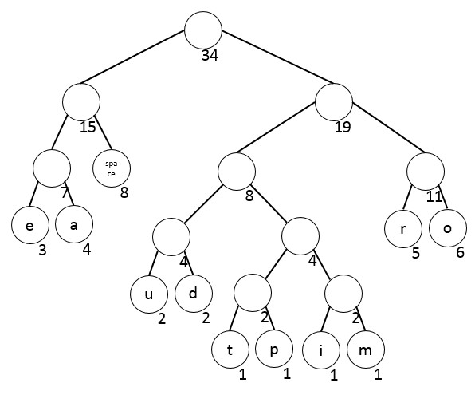
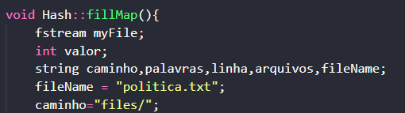
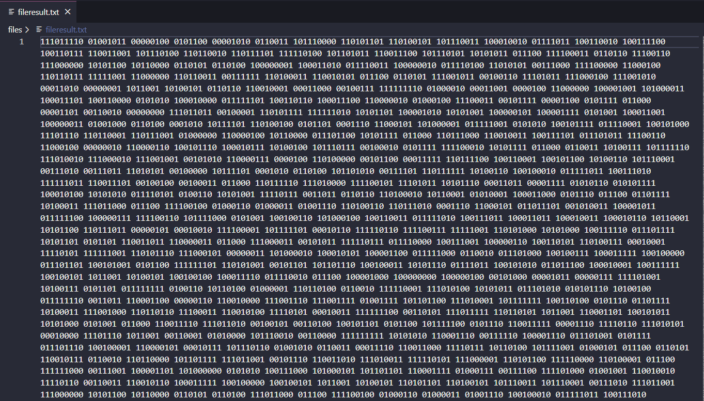

# Exercicio Árvore de Huffman

# Problema
O problema proposto é separado em: 

    (1) contabilizar a recorrência de cada palavra (RP) no arquivo; 
    (2) normalizar a contabilização entre 0 e 1 utilizando a formula -> RP / (max(RP) - min(RP)); 
    (3) Montar a árvore com as regras apresentadas por Huffman; 
    (4) Troque as palavras pela codificação binária (utilizar booleano para representar 0 e 1); 
    (5) Salve o arquivo em formato binário e observe qual foi o ganho de espaço obtido.
# Árvore de Huffman
Trata-se de uma codificação de caracteres que permite compactar arquivos de texto, ou seja, representar um arquivo de texto A por um arquivo de bits B bem menor. O algoritmo de Huffman calcula uma tabela de códigos sob medida para o arquivo A de modo que o arquivo B seja o menor possível.  

Uma árvore de Huffman é uma árvore binária em que cada nó interno tem dois filhos. Além disso, árvores de Huffman ignoram a relação de ordem (esquerdo, direito) entre os filhos de um nó. Para melhor estudar essas árvores, adotaremos uma definição mais abstrata que a usual.  

# Algoritmo

O algoritmo funciona com base em uma classe da Hash chama unordered_map onde esse metodo e muito utilizado para a busca, inserção e remoção de elementos têm complexidade média de tempo constante.

O código tambem conta com uma classe para a leitura de um arquivo ja especificado onde ao receber esse arquivo faz diversos tratamentos para que o código se torne mais eficiente como por exemplo ignorar stopwors (palavras muito recorentes que atrapalhariam a eficiecia do algoritmo "a", "e", "de" "aos" ...), tambem trata pontuação (",", "." ...)

# Funcionamento
Ao iniciar o algoritmo ele automaticamente ja lê o arquivo informado na função fillmap() "politica.txt".

Após isso passa pela fução normalize onde e feito o cálculo e depois disso a criação da árvore que logo depois será escrito em um novo arquivo os números em binários

Ao final da execução do algotimo o arquivo resultante ("FileResult.png") tem uma redução em seu tamanho sendo proporcional a quantidade de palavras repetidas apresentada no arquivo inicial ("politica.txt").

Comentario: Para o funcionamento do Programa é necessário limpa o arquivo resultante caso haja dados dentro do mesmo.
# Compilação e Execução

| Comando                |  Função                                                                                           |
| -----------------------| ------------------------------------------------------------------------------------------------- |
|  `make clean`          | Apaga a última compilação realizada contida na pasta build                                        |
|  `make`                | Executa a compilação do programa utilizando o gcc, e o resultado vai para a pasta build           |
|  `make run`            | Executa o programa da pasta build após a realização da compilação                                 |